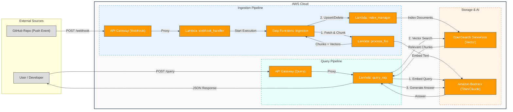
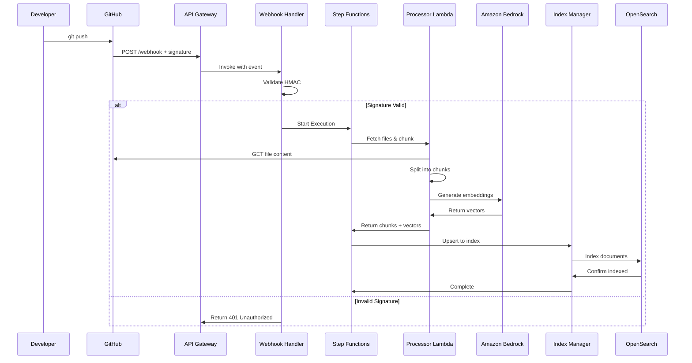
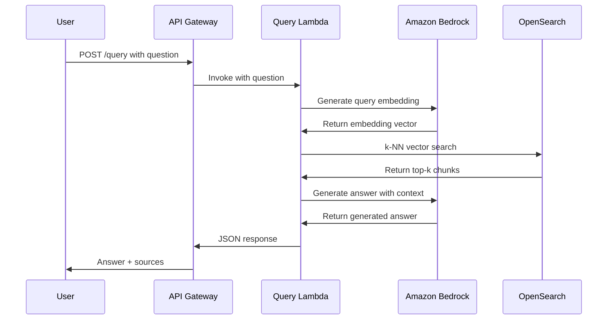
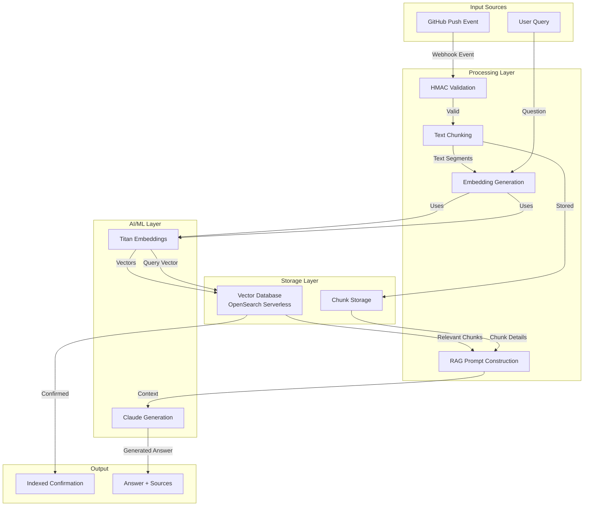
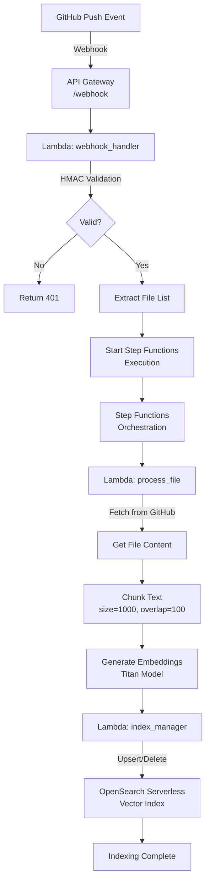
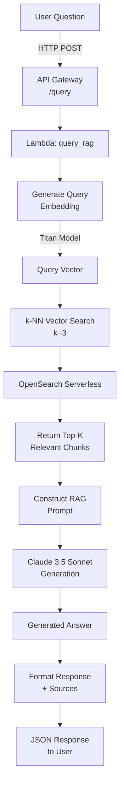
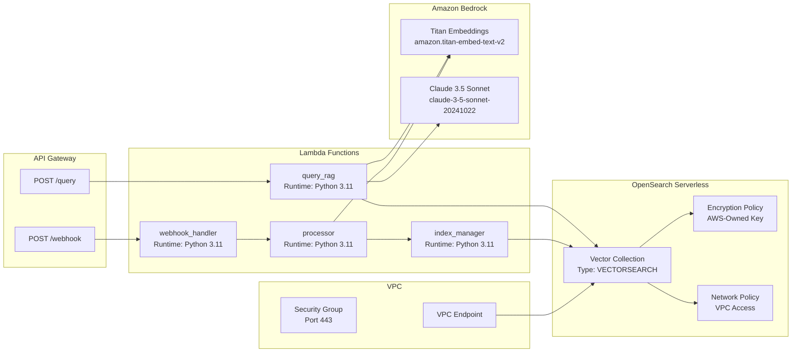

# Live RAG System Architecture

This document describes the event-driven architecture of the Live RAG System.

## High-Level Architecture

The system is composed of two main pipelines: **Ingestion** (keeping knowledge in sync) and **Query** (retrieving answers).

---

## Detailed Pipeline Architectures

### Ingestion Pipeline Flow

### Query Pipeline Flow

### Data Flow Diagram

---

## Component Details

### 1. Ingestion Pipeline

### 2. Query Pipeline

### 3. Infrastructure Components

---

## Component Details

### 1. Ingestion Pipeline
*   **Trigger**: GitHub Webhook on `git push`.
*   **Webhook Handler**: Validates HMAC signature and triggers Step Functions.
*   **Step Functions**: Orchestrates the ingestion process.
*   **Process Lambda**: Fetches file content from GitHub, chunks it, and generates embeddings using **Amazon Bedrock**.
*   **Index Manager**: Updates the **OpenSearch Serverless** vector index (Upsert or Delete).

### 2. Query Pipeline
*   **Trigger**: HTTP POST request to `/query`.
*   **Query Lambda**:
    1.  Converts user question to vector embedding via **Bedrock**.
    2.  Performs k-NN search on **OpenSearch Serverless**.
    3.  Constructs a prompt with retrieved context.
    4.  Generates final answer using **Bedrock** (Claude 3.5 Sonnet).

### 3. Storage & AI
*   **OpenSearch Serverless**: Stores document chunks and their vector embeddings.
*   **Amazon Bedrock**: Provides Foundation Models for embedding (Titan) and text generation (Claude).
